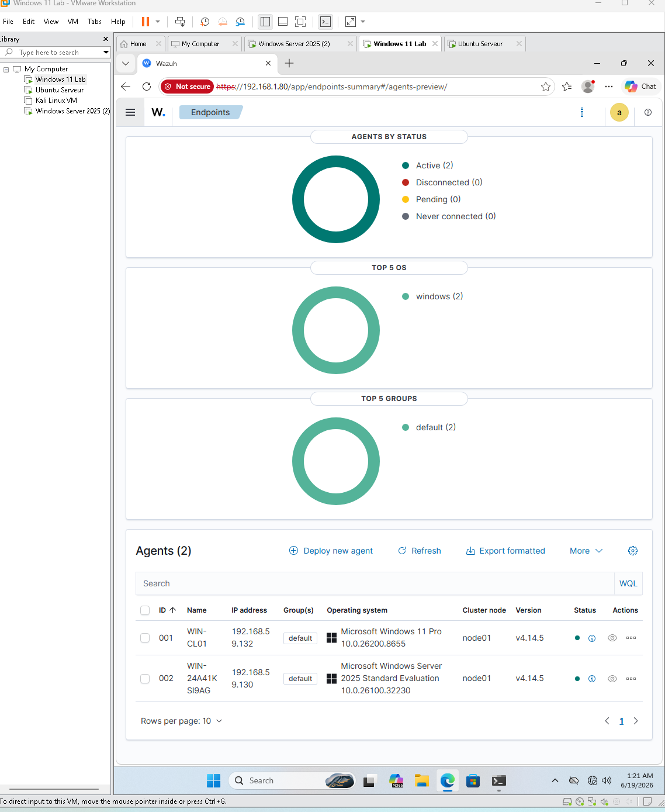
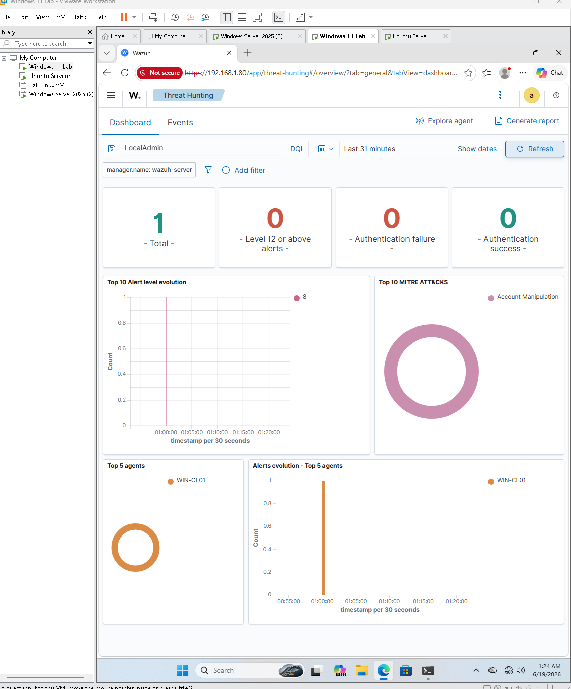
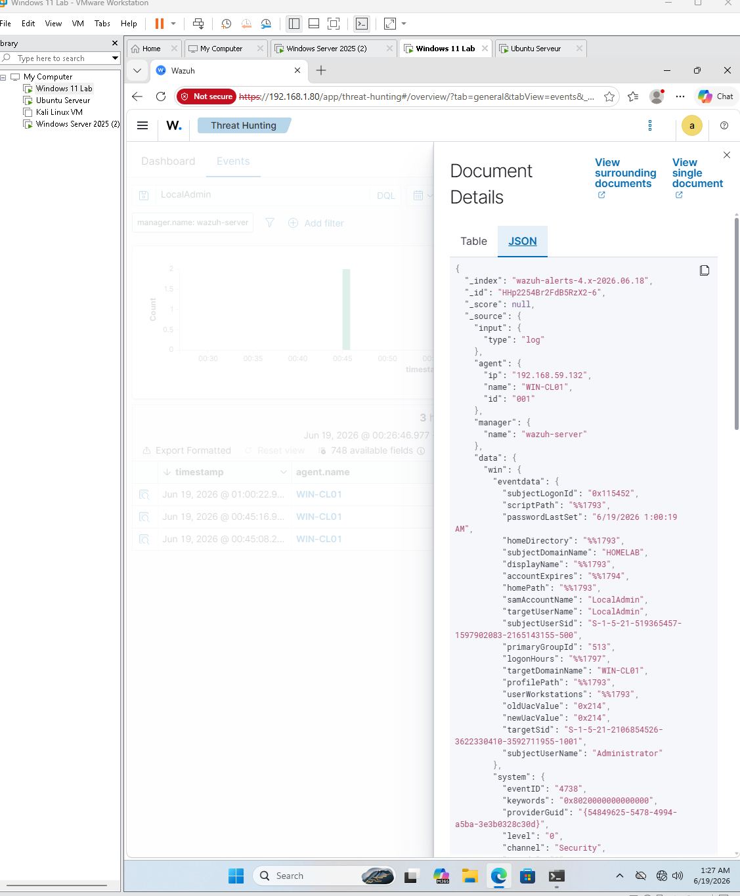

# Wazuh SIEM Home Lab

## Overview

This project documents the deployment of a Wazuh SIEM environment using Ubuntu 26.04 LTS in VMware.

The goal of this lab is to gain hands-on experience with:

* SIEM deployment
* Linux administration
* Security monitoring
* Endpoint visibility
* Threat detection
* Log analysis

## Environment

| Component          | Purpose            |
| ------------------ | ------------------ |
| Ubuntu 26.04       | Wazuh Server       |
| Wazuh Manager      | Log Collection     |
| Wazuh Indexer      | Data Storage       |
| Wazuh Dashboard    | Visualization      |
| Windows 11         | Monitored Endpoint |
| Kali Linux         | Attack Simulation  |
| VMware Workstation | Virtualization     |

## Lab Architecture

Windows 11 Agent → Wazuh Server

Kali Linux → Attack Simulation

Ubuntu → Wazuh Manager / Indexer / Dashboard

## Skills Demonstrated

* Linux Administration
* VMware Virtualization
* SIEM Deployment
* Security Monitoring
* Log Analysis
* Endpoint Detection
* Troubleshooting

## Project Status

Completed Ubuntu installation.

Completed Wazuh installation.

Completed dashboard configuration.

Windows endpoint integration in progress.
# 🛑 UPGRADE PHASE: Centralized SIEM & Telemetry Monitoring Pipeline

## 📌 Project Overview (Phase II)
After establishing the core Active Directory domain forest and client endpoints, the infrastructure was upgraded to a professional-grade **Security Operations Center (SOC) sandbox**. By deploying an enterprise **Wazuh SIEM Manager Node** over an isolated Linux engine, a centralized log analytics pipeline was engineered to ingest real-time security events across the entire domain layout. 

Adversarial emulation attacks were conducted against the environment to validate alert visibility, rule matching, and forensic parsing within the SIEM events matrix.

---

## 🚀 Architecture Enhancements
- **Central Monitoring Hub:** Ubuntu Linux Server running a localized Wazuh SIEM manager cluster.
- **Log Telemetry Forwarders:** Cross-platform monitoring daemons deployed natively to the **Windows Server 2025 Domain Controller** and **Windows 11 Workstation node**.
- **Data Transport Tunneling:** Advanced host firewalls and endpoint configuration profiles (`ossec.conf`) hardened to route traffic securely over port `1514`.

---

## 🛠️ Implementation & Troubleshooting Milestones

### 1. Endpoint Configuration Alignment
- Modified root system configuration parameters to re-route endpoint communication away from default templates directly into the Ubuntu manager's internal IP matrix.
- Synchronized local hypervisor clock states globally to prevent timeline authentication rejections within the core database.
- Resolved localized Active Directory Group Policy constraints to grant administrative terminal clearance over network configuration layers.

### 2. Adversary Emulation & Forensic Validation
- Simulated targeted **MITRE ATT&CK** adversarial techniques, including rapid authentication brute-forcing and account manipulation attempts against local system assets.
- Inspected raw JSON alert metadata schemas via the Wazuh Threat Hunting events panel to verify comprehensive log parsing and classification.

---

## 📈 Real-Time SIEM Ingestion Verification
### 📸 Deployment & Forensic Verification Proofs

#### 1. Live Environment Connection (Active Status)

#### 2. Threat Hunting Dashboard Analytics (MITRE ATT&CK Mapping)

#### 3. Deep-Dive Forensic Document Details (JSON Log Metadata)

Below is a forensic look at the exact event metadata captured during the adversary emulation phase, showcasing successful JSON log structure matching:

| Metadata Field | Captured Forensic Metric |
| -------------- | ------------------------ |
| **agent.name** | `WIN-CL01` (Windows 11 Client Workstation) |
| **data.win.eventdata.targetUserName** | `LocalAdmin` (Target Compromise Account) |
| **data.win.eventdata.subjectUserName**| `Administrator` (Triggering System Context) |
| **MITRE ATT&CK Mapping** | `Account Manipulation` |

---

## 🏆 Key Security Skills Proven
- **SIEM / SOC Operations:** Log parsing, index queries, target field filtration, and alert parsing.
- **Security Engineering:** Host security auditing, pipeline routing, and telemetry parsing.
- **Blue Teaming:** Threat hunting, incident verification, and rule-alignment frameworks.
